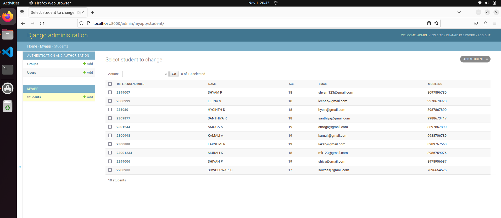

# Django ORM Web Application

## AIM
To develop a Django application to store and retrieve data from a database using Object Relational Mapping(ORM).

## Entity Relationship Diagram

Include your ER diagram here

## DESIGN STEPS

### STEP 1:
create a new exercise

### STEP 2:
Enter the code appopriately
### STEP 3:

Run the program

## PROGRAM
```
<!DOCTYPE html>
<html>
    <head>
        <title> This is site of SEC </title>
    </head>
    <body bgcolor="#8000080"text="FFFF00">
        <h1>Welcome to SEC </h1>
    </body>
</html>
```

## OUTPUT




## RESULT
Thus the program executed succesfully